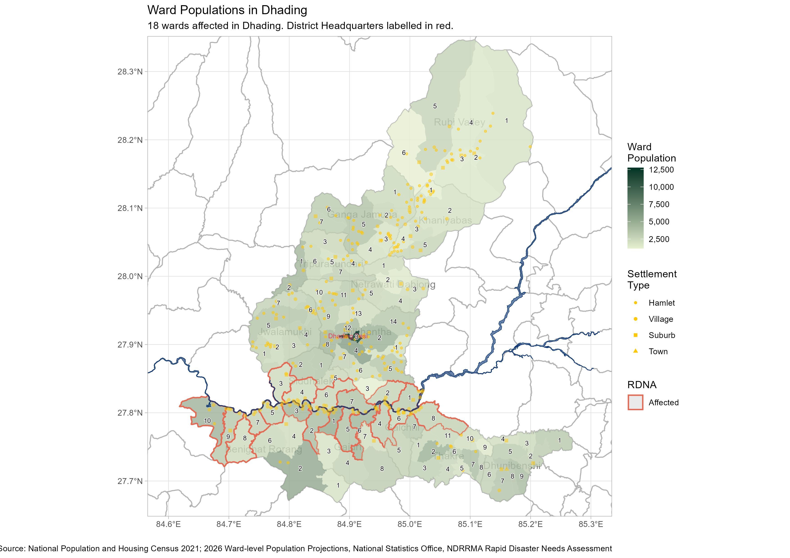
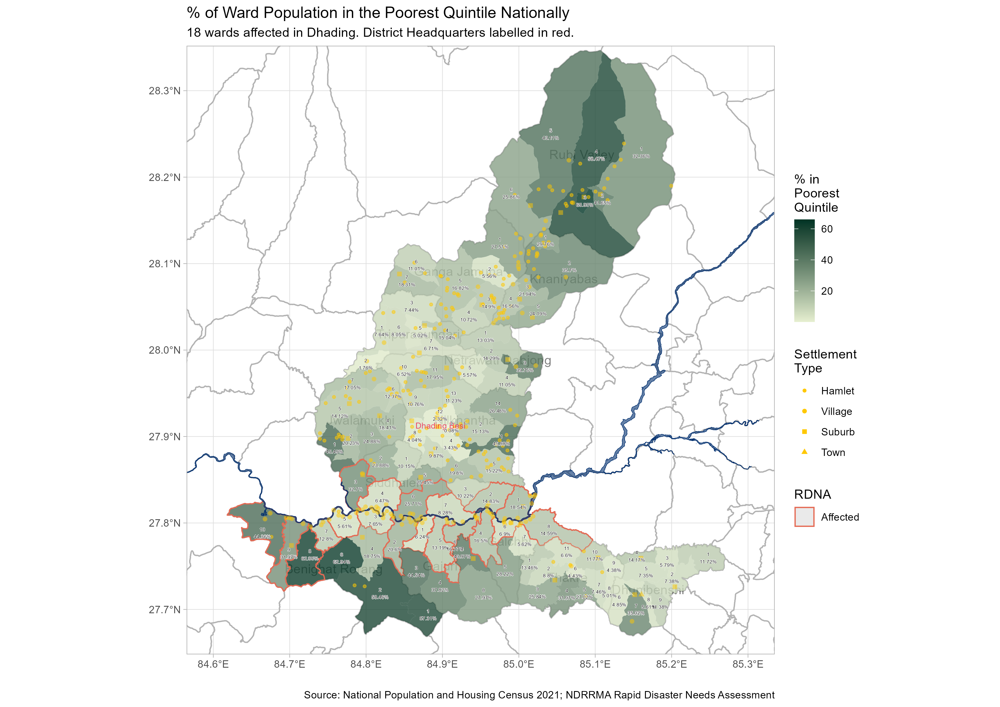
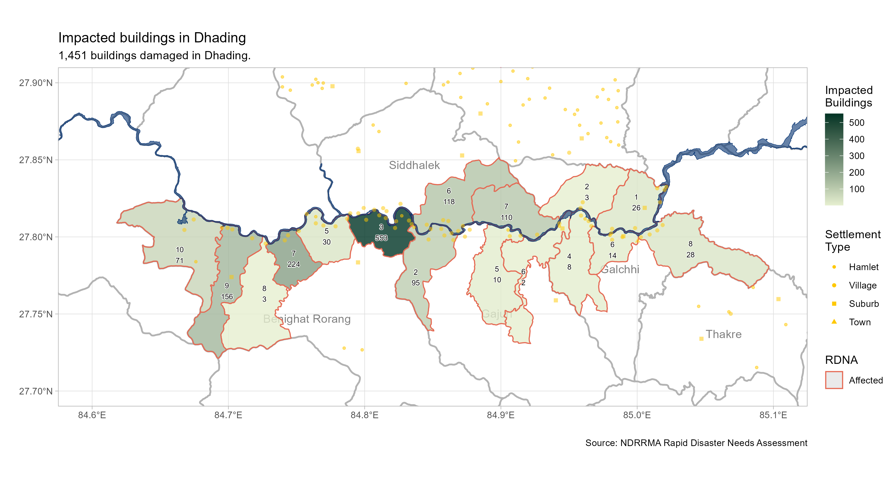
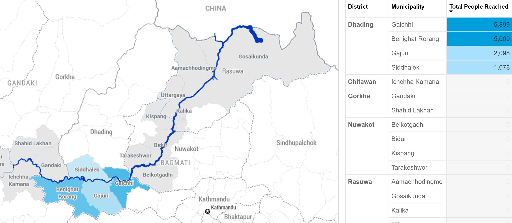
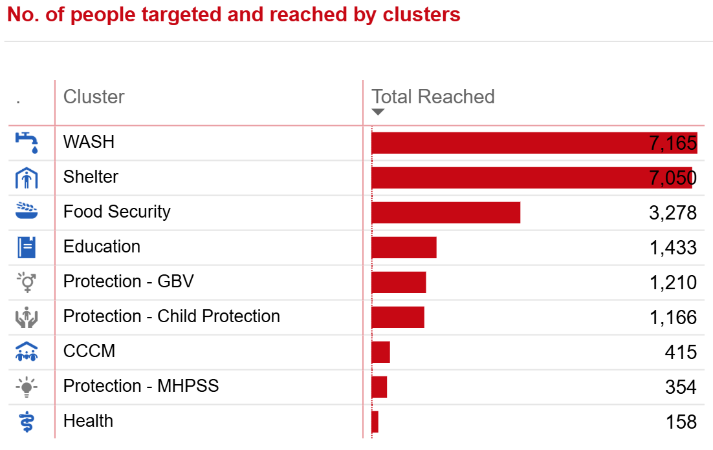
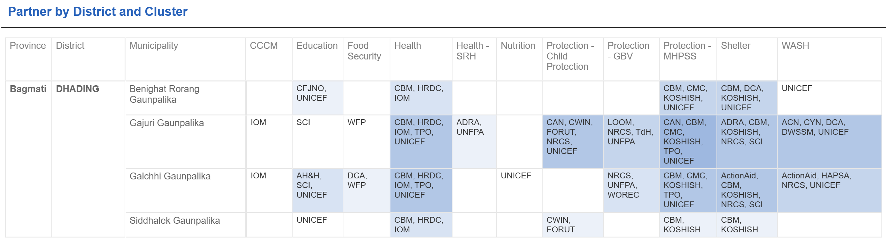

```{r setup, include=FALSE}

knitr::opts_chunk$set(echo=FALSE, fig.width=9, message = FALSE, warning=FALSE)

library(tidyverse)
library(sf)
library(readxl)
library(kableExtra)
library(flextable)
library(viridis)
library(scales)
library(janitor)
library(cowplot)
library(magick)
library(patchwork)
library(shadowtext)
library(showtext)
library(ggrepel)
library(terra)
library(tidyterra)
library(maptiles)
library(cowplot)
library(ggview)
library(flextable)
library(DT)

options(warn = -1)

# showtext_auto()

# font_add_google("Roboto", "roboto")

`%out%` <- Negate(`%in%`)

theme_set(theme_light())

options(scipen = 999)

```

```{r geodata, include=FALSE}

nepal_admin <- read_xlsx("./data/npl_admin_boundaries.xlsx", 
                         sheet = 7) |> 
  select(adm3_name, adm3_pcode, adm2_name, adm2_pcode, adm1_name, adm1_pcode)

affected_municipalities_wards <- read_xls("./data/Affected_wardsv2.xls") |> 
  janitor::clean_names() |> 
  select(adm1_pcode, 
         district = adm2_en, 
         adm2_pcode,
         municipality = adm3_en, 
         adm3_pcode, 
         ward = new_ward_n) |> 
  left_join(
    nepal_admin |> 
      distinct(adm1_name, adm1_pcode), 
    by = "adm1_pcode"
  ) |> 
  rename(province = adm1_name) |> 
  relocate(province, .before = adm1_pcode) |> 
  distinct(adm3_pcode, ward)

wards <- st_read("./data/shapefiles/npl_admn_ad4_py_s1_ocha_hp_wards.shp") |> 
  rename(ward = NEW_WARD_N) |> 
  janitor::clean_names() |> 
  mutate(district = str_to_title(district))

affected_wards <- read_xls("./data/Affected_wardsV2.xls") |> 
  janitor::clean_names()

adm3 <- st_read("./data/shapefiles/npl_admin_boundaries.shp/npl_admin3.shp")

adm2 <- st_read("./data/shapefiles/npl_admin_boundaries.shp/npl_admin2.shp")

river_buffer <- st_read("./data/shapefiles/aoi_affd_aff_py_s3_govn_pp_AOI500mBuffer.shp") 

river <- st_read("./data/shapefiles/Flood Extent Shape file/Flood extent_SHP.shp")

holding_centres <- st_read("./data/shapefiles/npl_shel_shl_pt_s3_various_pp_holding_centre.shp")

settlements <- st_read("./data/shapefiles/npl_stle_stl_pt_s0_osm_pp_settlements.shp") |> 
  clean_names() |> 
  mutate(point_size = case_when(
    fclass == "hamlet" ~ .5, 
    fclass == "village" ~ .7, 
    fclass == "suburb" ~ .9,
    fclass == "town" ~ 1.25, 
    fclass == "city" ~ 1.5, 
    fclass == "national_capital" ~ 2, 
    TRUE ~ 10
  ))

# river <- st_read("./data/shapefiles/Flood Extent.gpkg", options = "CONVERT_TO_LINEAR=YES") 

```

```{r data, include=FALSE}

municipal_damage_losses <- read_csv("./data/municipal_damage_loss.csv")

municipal_long <- municipal_damage_losses |> 
  mutate(affected_hectares_agriculture = paddy_affected_hectares + vegetables_affected_hectares, 
         total_baseline_hectares = paddy_baseline_hectares + vegetables_baseline_hectares, 
         pc_affected_hectares = affected_hectares_agriculture / total_baseline_hectares, 
         pc_affected_buildings = affected_buildings / estimated_buildings_in_damaged_corridor, 
         pc_impacted_households = impacted_households / households_in_affected_wards_census_2021) |> 
  select(adm2_pcode, adm3_pcode, impacted_households, 
         pc_impacted_households, 
         impacted_population = impacted_population_total,
         affected_buildings, pc_affected_buildings,
         affected_hectares_agriculture, pc_affected_hectares) |> 
  pivot_longer(cols = impacted_households:pc_affected_hectares, 
               names_to = "variable", 
               values_to = "value") 

consolidated_date <- "20260914"

consolidated <- read_xlsx("./data/NEPAL 5W Data Consolidation (ADMIN_ONLY) 20260914.xlsx",
                          skip = 5,
                          sheet = "Compiled_Data") |> 
  janitor::clean_names() |> 
  mutate_at(c("province", "district", "municipality"), ~ str_to_title(.)) |> 
  mutate_at(c("province", "district", "municipality"), ~ str_trim(.)) |> 
  mutate(municipality = str_remove_all(municipality, " Gaunpalika")) |> 
  mutate(province = case_when(
    district == "Gorkha" ~ "Gandaki", 
    district == "Tanahu" ~ "Gandaki",
    TRUE ~ province
  )) |> 
  mutate(district = case_when(
    municipality == "Gosaikunda" ~ "Rasuwa", 
    municipality == "Bidur Municipality" ~ "Nuwakot", 
    TRUE ~ district
  )) |> 
  mutate(municipality = case_when(
    municipality == "Benighat" ~ "Benighat Rorang", 
    municipality == "Galchi Rural Municipality" ~ "Galchhi", 
    municipality == "Gandaki" ~ "Gandaki", 
    municipality == "Bheri Malika Municipality" ~ "Bheri Malika", 
    municipality == "Nalgad Municipality" ~ "Nalgad", 
    municipality == "Kathmandu Metropolitian City" ~ "Kathmandu", 
    municipality == "Nagarjun Municipality" ~ "Nagarjun", 
    municipality == "Belkotgadhi Municipality|Belkotgadhi Nagarpalika" ~ "Belkotgadhi", 
    str_detect(municipality, "Bidur") ~ "Bidur", 
    municipality == "Kispang Municipality" ~ "Kispang", 
    municipality == "Tarkeshwor" ~ "Tarakeshwor", 
    municipality == "Rasuwa Dao, Dhunche" ~ "Gosaikunda",
    str_detect(municipality, "Devghat") ~ "Devghat", 
    str_detect(municipality, "Gandaki") ~ "Gandaki", 
    str_detect(municipality, "Belkotgadhi") ~ "Belkotgadhi", 
    municipality == "Aanbukhaireni" ~ "Aanbu Khaireni",
    TRUE ~ municipality)) |> 
  left_join(
    nepal_admin |> 
      distinct(adm1_name, adm1_pcode), 
    by = c("province" = "adm1_name")
  ) |> 
  left_join(
    nepal_admin |> 
      distinct(adm1_pcode, adm2_name, adm2_pcode), 
    by = c("adm1_pcode", "district" = "adm2_name")
  ) |> 
  left_join(
    nepal_admin |> 
      distinct(adm1_pcode, adm2_pcode, 
             adm3_name, adm3_pcode), 
    by = c("adm1_pcode", "adm2_pcode", "municipality" = "adm3_name")
  ) |> 
  rename(individuals_reached = total_number_of_beneficiaries_reached_people_individuals) |> 
  filter(disaster_response_plan == "Rasuwa Flood Response") 

census_flat <- cbind(
  read_csv("./data/nepal_census2021_ward_level_household_tables_bagmati_gandaki_flat.csv") |> 
    mutate(match1 = paste0(adm2_pcode, adm3_pcode, ward)),
  read_csv("./data/nepal_census2021_ward_level_individual_tables_bagmati_gandaki_flat.csv") |> 
    mutate(match2 = paste0(adm2_pcode, adm3_pcode, ward)) |> 
    select(-c(province:ward), -total_households, -rdna_affected)
)


# Using this temporarily until the population figures are resolved
differences <- read_csv("./data/differences_between_flash_appeal_and_rdna_affected_wards.csv") |> 
  mutate(match3 = paste0(adm2_pcode, adm3_pcode, ward))

damage_points <- read_xlsx("./data/Consolidated Damage.xlsx") |> 
  clean_names() |> 
  rename(x = long, y = lat)

impacted_buildings <- read_xlsx("./data/impacted_buildings.xlsx") |> 
  mutate(municipality = ifelse(municipality == "Ichcha Kamana", 
                               "Ichchha Kamana", 
                               municipality)) |> 
  left_join(
    nepal_admin |> 
      distinct(adm3_name, adm1_pcode, adm2_pcode, adm3_pcode), 
    by = c("municipality" = "adm3_name")
  ) |> 
  filter(adm3_pcode != "NP0327301" & adm3_pcode != "NP0335301")

census_working <- census_flat |> 
  mutate(improved_drinking_water = drinking_water_tap_piped_within_premises +
           drinking_water_tap_piped_outside_premises +
           drinking_water_tubewell_handpump +
           drinking_water_covered_well_kuwa, 
         no_toilet_public_toilet = toilet_no_toilet + toilet_public
           ) |>
  select(province, district, municipality, adm1_pcode:ward, rdna_affected,
         total_households, population_total, 
         average_household_size,
         population_with_disabilities, 
         population_pc_urban, 
         house_quality_least_adequate_pc, house_quality_inadequate_pc, 
         improved_drinking_water, no_toilet_public_toilet, 
         wealth_quintile_poorest_quintile_count,
         wealth_quintile_poorest_quintile_pc, 
         wealth_quintile_poorer_quintile_pc)

wards_joined <- wards |> 
  select(-district) |> 
  left_join(
    differences |> 
      mutate(rdna = ifelse(rdna_affected == 1, "Affected", NA_character_)) |> 
      select(adm2_pcode, adm3_pcode, ward, rdna, rdna_affected, projection_2026_population_total), 
    by = c("adm2_pcode", "adm3_pcode", "ward")
  ) 

population_projections <- read_csv("./data/population_projections_2026_affected_wards_flat.csv")

```

# Introduction


[](https://raw.githubusercontent.com/nepal-rasuwa-trishuli-floods-undac/nepal_floods_reports/main/plots/dhading_population_map.png)

<br>


The [population](https://censusresults.nsonepal.gov.np/) of the affected wards in Dhading district is `r filter(population_projections, district == "Dhading") %>% {sum(.$projection_2026_population_total)}  |> format(big.mark = ",")`. Of the `r census_flat |> filter(district == "Dhading") |> nrow()` wards in Dhading district, `r differences |> filter(district == "Dhading") |> nrow()` have been affected by the flooding, according to the NDRRMA. As can be seen from the map, the affected wards along the river are home to numerous settlements, though all still much smaller than the district seat in Dhading Besi. 

17.19% (14,375) out of the 83,622 [households](https://censusresults.nsonepal.gov.np/) in Dhading are in the poorest quintile of households nationally, below the average for Nepal. 


```{r eval=FALSE}
census_working |> 
  left_join(
    differences |> 
      select(adm3_pcode, ward, rdna_affected), 
    by = c("adm3_pcode", "ward")
  ) |> 
  filter(rdna_affected == 1) |> 
  mutate(population_poorest_quintile = wealth_quintile_poorest_quintile_count * 
           average_household_size) %>%
  {sum(.$population_poorest_quintile)}

census_working |> filter(district == "Dhading" & rdna_affected == 1)  %>%
  {sum(.$population_with_disabilities)}
```


<br>

[](https://raw.githubusercontent.com/nepal-rasuwa-trishuli-floods-undac/nepal_floods_reports/main/plots/dhading_poorest_quintile.png)

<br>

The poorest parts of the district are in the south of Benighat Rorang and in the upper reaches of the Rubi Valley. Although Benighat Rorang-8 is quite poor, it is only marginally affected and had very limited exposure to the river. 2,976 (20.7%) out of the 14,375 persons in the poorest quintile live in the affected wards. 


```{r eval=FALSE}
census_flat |> 
  left_join(
    wards_joined |>
      st_drop_geometry() |> 
      select(adm3_pcode, ward, rdna_affected) |> 
      mutate(rdna_affected = ifelse(rdna_affected == 0, NA_real_, rdna_affected)), 
    by = c("adm3_pcode", "ward")
  ) |> 
  group_by(rdna_affected) |> 
  filter(district == "Dhading") |> 
  summarise(poorest_quintile_count = sum(wealth_quintile_poorest_quintile_count, na.rm = TRUE))

census_working |> 
  group_by(rdna_affected) |> 
  filter(district == "Dhading") |> 
  summarise(poorest_quintile_count = sum(wealth_quintile_poorest_quintile_count, na.rm = TRUE))

impacted_buildings |> 
  filter(adm2_pcode == "NP0330") |> 
  arrange(desc(impacted_buildings))
```


As of the 2021 Census, there were `r filter(census_flat, district == "Dhading" & rdna_affected == 1)  %>% {sum(.$population_with_disabilities, na.rm = TRUE)} |> format(big.mark = ",")` people with disabilities in the district, though it should be noted that this figure relies on self-reporting, so the actual number might be much higher.

Clicking on any of the maps will lead you to a larger version of the map. 


<br><br><br>


# Needs

[](https://raw.githubusercontent.com/nepal-rasuwa-trishuli-floods-undac/nepal_floods_reports/main/plots/dhading_impacted_buildings.png)


<br>

Based on the NDRRMA Rapid Disaster Needs Assessment, `r filter(municipal_damage_losses, district == "Dhading") %>% {sum(.$impacted_buildings, na.rm = TRUE)} |> format(big.mark = ",")` buildings were damaged in the floods. This damage to housing private buildings has affected `r filter(municipal_damage_losses, district == "Dhading") %>% {sum(.$impacted_population_total, na.rm = TRUE)} |> format(big.mark = ",")` people. Benighat Rorang-3 has the highest number of damaged buildings out of all the wards in Dhading. 

<br>

```{r}
municipal_damage_losses |> 
  filter(district == "Dhading" & !is.na(total_damage_including_household_assets_npr_crore)) |> 
  select(municipality, 
         Businesses_affected = estimated_affected_establishments, 
         Total_damage_incl._households_assets_npr_crore = total_damage_including_household_assets_npr_crore) |> 
  arrange(desc(Total_damage_incl._households_assets_npr_crore)) |>
  kable(caption = "Economic impacts and losses in Dhading, NDRRMA Rapid Disaster Needs Assessment") |> 
  kable_classic(full_width = F) |> 
  kable_styling(bootstrap_options = "striped")
 # flextable() |> 
 # theme_zebra() |> 
 # flextable::set_caption(as_paragraph(as_chunk("Economic impacts and losses in Rasuwa")))
```

<br>


277 hectares of agricultural land was impacted by the flooding. Considering that Dhading was further downstream than some of the other affected areas, this is considerably less than the 1,228 hectares affected in Nuwakot and less than the 283 hectares in Rasuwa. 

<br>

```{r}
municipal_damage_losses |> 
  filter(district == "Dhading") |> 
  replace_na(list(paddy_affected_hectares = 0, 
                  vegetables_affected_hectares = 0)) |> 
  mutate(total_affected_hectares = paddy_affected_hectares + vegetables_affected_hectares) |> 
  filter(total_affected_hectares > 0) |>
  select(municipality, total_affected_hectares) |>
  arrange(desc(total_affected_hectares)) |> 
  kable(caption = "Total affected hectares of agricultural land") |> 
  kable_classic(full_width = F) |> 
  kable_styling(bootstrap_options = "striped")
```

<br><br><br>

## Comparison between districts

```{r}
municipal_damage_losses |> 
  group_by(district) |> 
  summarise(
    number_of_affected_wards = sum(number_of_affected_wards, na.rm = TRUE), 
    impacted_buildings = sum(impacted_buildings, na.rm = TRUE),
    paddy_affected_hectares = sum(paddy_affected_hectares, na.rm = TRUE), 
    vegetables_affected_hectares = sum(vegetables_affected_hectares, na.rm = TRUE)
  ) |> 
  mutate(agricultural_land_affected_ha = paddy_affected_hectares + vegetables_affected_hectares) |> 
  select(district, number_of_affected_wards, impacted_buildings, agricultural_land_affected_ha) |> 
  filter(district != "Tanahu") |> 
  pivot_longer(!district, 
               names_to = "variable", 
               values_to = "value") |> 
  mutate(variable = fct_relevel(variable, 
                                c("impacted_buildings", 
                                  "agricultural_land_affected_ha", 
                                  "number_of_affected_wards"))) |> 
  mutate(variable = str_to_title(str_replace_all(variable, "_", " "))) |>
  mutate(district = fct_relevel(district, 
                                c("Nuwakot", "Rasuwa", "Dhading", "Gorkha", "Chitawan"))) |> 
  ggplot(aes(x = value, y = fct_rev(district), fill = fct_rev(variable))) + 
  geom_col() + 
  geom_text(aes(label = comma(value)),
            hjust = "inward") +
  scale_fill_manual(values = c("#cee3a0","#338c46", "#72bf44")) +
  facet_wrap(~ variable, scales = "free_x") + 
  scale_x_continuous(labels = comma) + 
  labs(x = "Hectares affected / Number of imapcted buildings / Number of wards", y = "", 
       title = "Comparison of Flood damage between districts", 
       caption = "Source: NDRRMA Rapid Disaster Needs Assessment") + 
  theme(legend.position = "none", 
        strip.background = element_rect(fill = "black")) 
  

```


<br><br><br>

# Response


[](https://app.powerbi.com/view?r=eyJrIjoiZTQ0MGE1NWEtOWJlMi00YmU4LWFhYjMtMTg0OTRmNTRmMGQ1IiwidCI6IjBmOWUzNWRiLTU0NGYtNGY2MC1iZGNjLTVlYTQxNmU2ZGM3MCIsImMiOjh9)

<br>

Galchhi and Benighat Rorang are the focuses of the response activities in Dhading, in spite of damage being much greater in Benighat Rorang. From the beneficiary frequencies table below (which is inclusive of double counting, and thus indicative of where agencies have focused their resources), we can see that affected persons have been reached by both WASH and Shelter activities. 

Clicking on any of the 5W maps and tables will lead to the 5Ws PowerBI dashboard. 

<br>

[](https://app.powerbi.com/view?r=eyJrIjoiZTQ0MGE1NWEtOWJlMi00YmU4LWFhYjMtMTg0OTRmNTRmMGQ1IiwidCI6IjBmOWUzNWRiLTU0NGYtNGY2MC1iZGNjLTVlYTQxNmU2ZGM3MCIsImMiOjh9)


```{r}
ward_reporting <- consolidated |> 
  filter(district == "Dhading") |> 
  filter(individuals_reached > 0) |> 
  mutate(has_ward = ifelse(ward > 20 | is.na(ward), "no", "yes")) |> 
  group_by(has_ward) |> 
  summarise(individuals_reached = sum(individuals_reached, na.rm = TRUE))


```


<br>

Granular reporting is currently quite poor in Dhading: `r round((ward_reporting |> filter(has_ward == "yes") |> pull(individuals_reached)) / (ward_reporting %>% {sum(.$individuals_reached)}) * 100, 2)`% of the beneficiary frequencies were reported at the ward level. To date, no beneficiaries have been reported in Benighat Rorang-3, the most affected ward, and only 50 were reported in Benighat Rorang-7, the second-most affected ward. 


```{r eval=FALSE}
consolidated |> 
  filter(district == "Nuwakot" & ward < 15) |> 
  group_by(municipality, ward) |> 
  summarise(individuals_reached = sum(individuals_reached, na.rm = TRUE)) |> 
  arrange(desc(individuals_reached)) %>%
  {sum(.$individuals_reached)}

consolidated |> 
  filter(district == "Nuwakot" & ward == 7) |> 
  group_by(activity) |> 
  summarise(
    individuals_reached = sum(individuals_reached, na.rm = TRUE)
  ) |> 
  arrange(desc(individuals_reached))

consolidated |> 
  filter(district == "Nuwakot") |> 
  mutate(holding_centre = ifelse(!is.na(holding_centre_displacement_site), "yes", "no")) |> 
  group_by(municipality, ward, holding_centre) |> 
  summarise(individuals_reached = sum(individuals_reached), 
            .groups = "drop") |> 
  pivot_wider(names_from = holding_centre, 
              values_from = individuals_reached)
```


<br><br><br>

## Agency presence

Agency presence is highest Gajuri, though there are 18 Lead Agencies and 13 Implementing Partners in Dhading, far fewer than the 45 ans 34 in Nuwakot and the 32 ans 23 in Rasuwa.  

<br>

[](https://app.powerbi.com/view?r=eyJrIjoiZTQ0MGE1NWEtOWJlMi00YmU4LWFhYjMtMTg0OTRmNTRmMGQ1IiwidCI6IjBmOWUzNWRiLTU0NGYtNGY2MC1iZGNjLTVlYTQxNmU2ZGM3MCIsImMiOjh9)


<br><br><br>

# References and useful datasets

## Interactive Reference Table


```{r}
census_flat |> 
  filter(district == "Dhading") |>
  left_join(
    read_csv("./data/population_projections_2026_affected_wards_flat.csv") |> 
      select(
        population_2026 = projection_2026_population_total, 
        population_2026_male = projection_2026_population_male,
        population_2026_female = projection_2026_population_female, 
        affected, adm3_pcode, ward
      ),
    by = c("adm3_pcode", "ward")) |>
  left_join(impacted_buildings |> 
              select(adm3_pcode, ward, impacted_buildings), 
            by = c("adm3_pcode", "ward")) |> 
  filter(affected == "affected") |> 
  select(municipality, ward,
         impacted_buildings, 
         total_households, population_2026, sex_ratio, 
         population_density, 
         population_2026_male, 
         population_2026_female, 
         total_dependency_ratio, 
         adm3_pcode) |> 
  mutate_at(vars(sex_ratio, population_density), ~ round(.x, 2)) |> 
    datatable(filter = list(position = "top", clear = FALSE), 
              options = list(pageLength = 10, scrollX = TRUE),
              caption = htmltools::tags$caption(style = "caption-side: top;
                                              text-align: center; font-size: 140%;",
                                              "Selected Demographic Census Variables of Affected Wards; source: National Statistics Office, Nepal"))
 
```

<br><br><br>

## Useful links and datasets

### [Digitised NDRRMA Municipal Damage Tables](https://drive.google.com/drive/folders/1GehdusDNji6HGQGQ6R7cEHNJC3BwwNau?usp=drive_link)

### [5W Dashboard](https://app.powerbi.com/view?r=eyJrIjoiZTQ0MGE1NWEtOWJlMi00YmU4LWFhYjMtMTg0OTRmNTRmMGQ1IiwidCI6IjBmOWUzNWRiLTU0NGYtNGY2MC1iZGNjLTVlYTQxNmU2ZGM3MCIsImMiOjh9)

### [Consolidated Census ward-level household and population](https://drive.google.com/drive/folders/1gNkJJR6Q4psoCrWyBcUyzqL9wcKVVRbb?usp=drive_link)
Variables include a breakdown of housing materials, wealth quintile, school attendance and household WASH. 

### [Logistics Cluster Access Map](https://logie.logcluster.org/?op=npl)
Updated regularly. 


