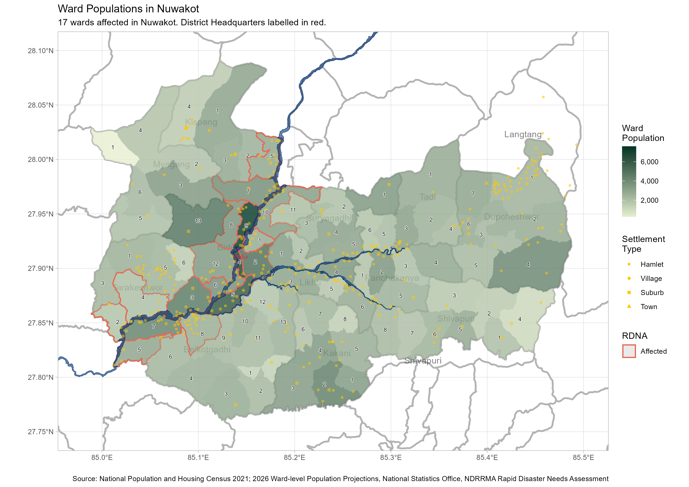
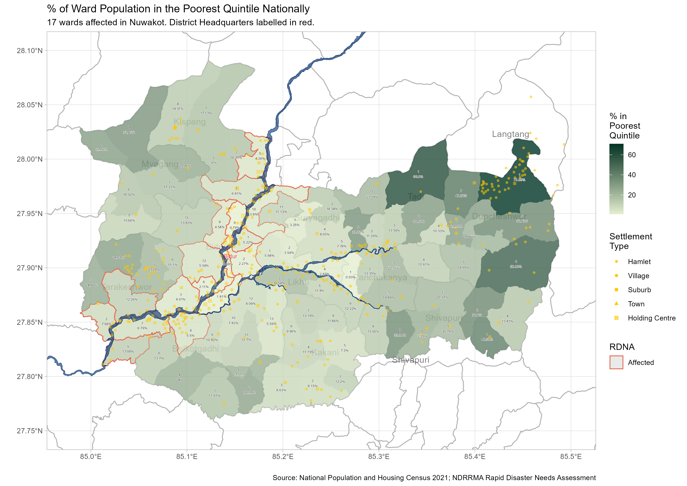
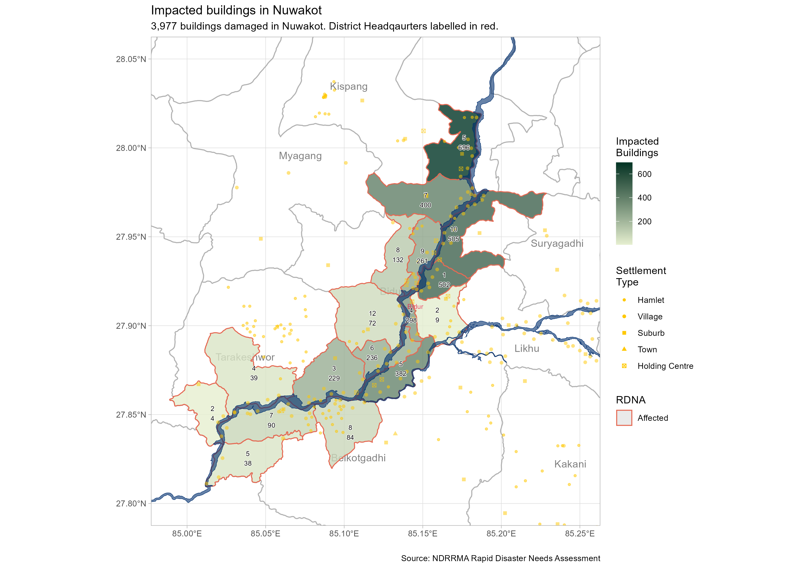
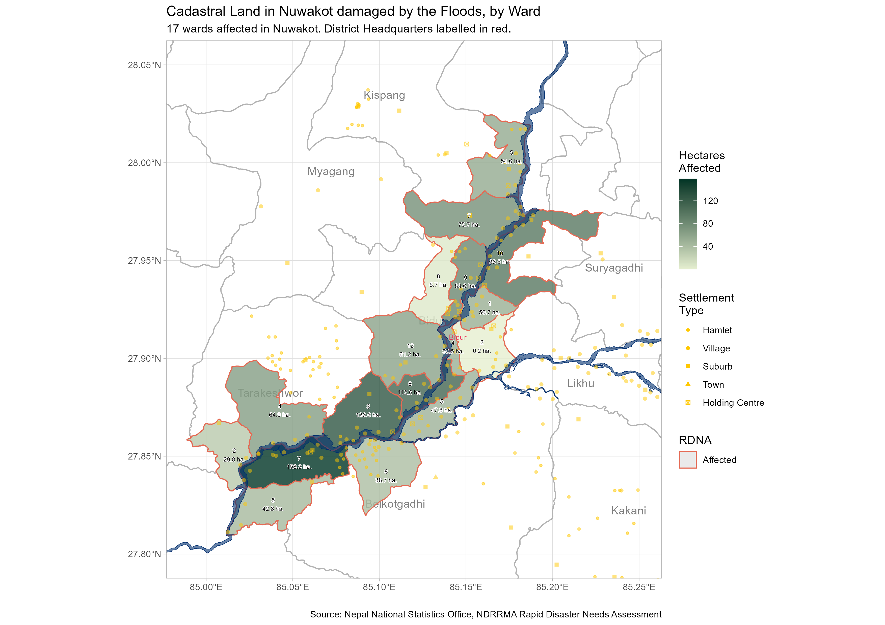
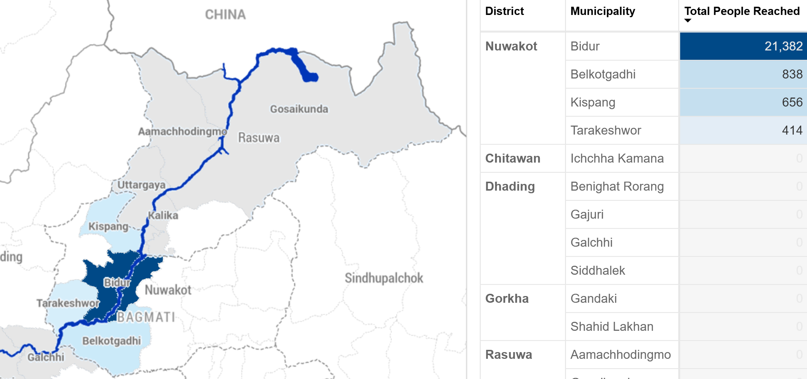
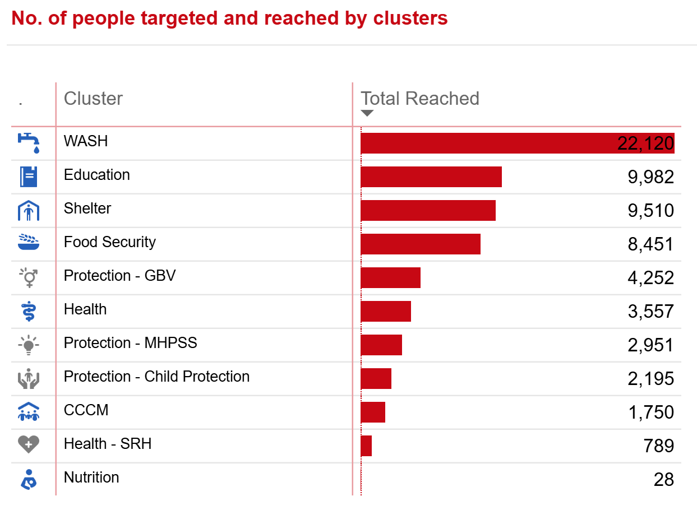
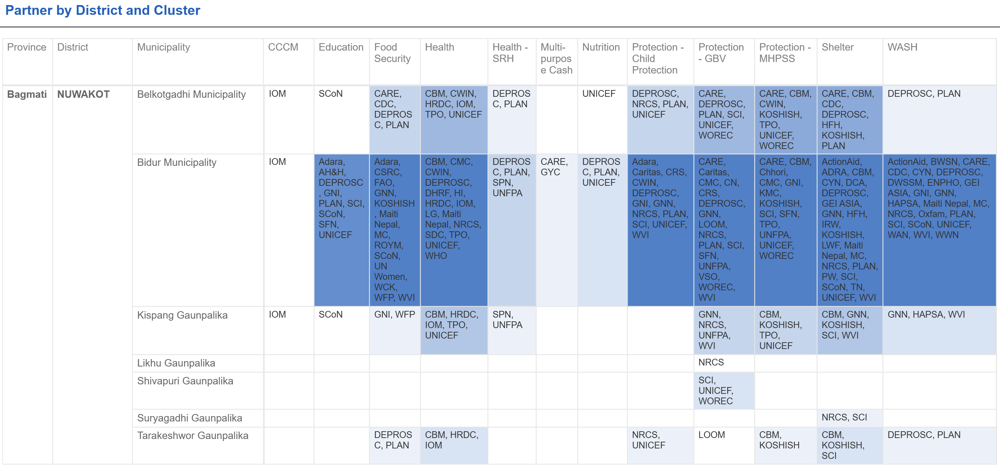

```{r setup, include=FALSE}

knitr::opts_chunk$set(echo=FALSE, fig.width=9, message = FALSE, warning=FALSE)

library(tidyverse)
library(sf)
library(readxl)
library(kableExtra)
library(flextable)
library(viridis)
library(scales)
library(janitor)
library(cowplot)
library(magick)
library(patchwork)
library(shadowtext)
library(showtext)
library(ggrepel)
library(terra)
library(tidyterra)
library(maptiles)
library(cowplot)
library(ggview)
library(flextable)
library(DT)

options(warn = -1)

# showtext_auto()

# font_add_google("Roboto", "roboto")

`%out%` <- Negate(`%in%`)

theme_set(theme_light())

options(scipen = 999)

```

```{r geodata, include=FALSE}

nepal_admin <- read_xlsx("./data/npl_admin_boundaries.xlsx", 
                         sheet = 7) |> 
  select(adm3_name, adm3_pcode, adm2_name, adm2_pcode, adm1_name, adm1_pcode)

affected_municipalities_wards <- read_xls("./data/Affected_wardsv2.xls") |> 
  janitor::clean_names() |> 
  select(adm1_pcode, 
         district = adm2_en, 
         adm2_pcode,
         municipality = adm3_en, 
         adm3_pcode, 
         ward = new_ward_n) |> 
  left_join(
    nepal_admin |> 
      distinct(adm1_name, adm1_pcode), 
    by = "adm1_pcode"
  ) |> 
  rename(province = adm1_name) |> 
  relocate(province, .before = adm1_pcode) |> 
  distinct(adm3_pcode, ward)

wards <- st_read("./data/shapefiles/npl_admn_ad4_py_s1_ocha_hp_wards.shp") |> 
  rename(ward = NEW_WARD_N) |> 
  janitor::clean_names() |> 
  mutate(district = str_to_title(district))

affected_wards <- read_xls("./data/Affected_wardsV2.xls") |> 
  janitor::clean_names()

adm3 <- st_read("./data/shapefiles/npl_admin_boundaries.shp/npl_admin3.shp")

adm2 <- st_read("./data/shapefiles/npl_admin_boundaries.shp/npl_admin2.shp")

river_buffer <- st_read("./data/shapefiles/aoi_affd_aff_py_s3_govn_pp_AOI500mBuffer.shp") 

river <- st_read("./data/shapefiles/Flood Extent Shape file/Flood extent_SHP.shp")

holding_centres <- st_read("./data/shapefiles/npl_shel_shl_pt_s3_various_pp_holding_centre.shp")

settlements <- st_read("./data/shapefiles/npl_stle_stl_pt_s0_osm_pp_settlements.shp") |> 
  clean_names() |> 
  mutate(point_size = case_when(
    fclass == "hamlet" ~ .5, 
    fclass == "village" ~ .7, 
    fclass == "suburb" ~ .9,
    fclass == "town" ~ 1.25, 
    fclass == "city" ~ 1.5, 
    fclass == "national_capital" ~ 2, 
    TRUE ~ 10
  ))

# river <- st_read("./data/shapefiles/Flood Extent.gpkg", options = "CONVERT_TO_LINEAR=YES") 

```

```{r data, include=FALSE}

municipal_damage_losses <- read_csv("./data/municipal_damage_loss.csv")

municipal_long <- municipal_damage_losses |> 
  mutate(affected_hectares_agriculture = paddy_affected_hectares + vegetables_affected_hectares, 
         total_baseline_hectares = paddy_baseline_hectares + vegetables_baseline_hectares, 
         pc_affected_hectares = affected_hectares_agriculture / total_baseline_hectares, 
         pc_affected_buildings = affected_buildings / estimated_buildings_in_damaged_corridor, 
         pc_impacted_households = impacted_households / households_in_affected_wards_census_2021) |> 
  select(adm2_pcode, adm3_pcode, impacted_households, 
         pc_impacted_households, 
         impacted_population = impacted_population_total,
         affected_buildings, pc_affected_buildings,
         affected_hectares_agriculture, pc_affected_hectares) |> 
  pivot_longer(cols = impacted_households:pc_affected_hectares, 
               names_to = "variable", 
               values_to = "value") 

consolidated_date <- "20260914"

consolidated <- read_xlsx("./data/NEPAL 5W Data Consolidation (ADMIN_ONLY) 20260914.xlsx",
                          skip = 5,
                          sheet = "Compiled_Data") |> 
  janitor::clean_names() |> 
  mutate_at(c("province", "district", "municipality"), ~ str_to_title(.)) |> 
  mutate_at(c("province", "district", "municipality"), ~ str_trim(.)) |> 
  mutate(municipality = str_remove_all(municipality, " Gaunpalika")) |> 
  mutate(province = case_when(
    district == "Gorkha" ~ "Gandaki", 
    district == "Tanahu" ~ "Gandaki",
    TRUE ~ province
  )) |> 
  mutate(district = case_when(
    municipality == "Gosaikunda" ~ "Rasuwa", 
    municipality == "Bidur Municipality" ~ "Nuwakot", 
    TRUE ~ district
  )) |> 
  mutate(municipality = case_when(
    municipality == "Benighat" ~ "Benighat Rorang", 
    municipality == "Galchi Rural Municipality" ~ "Galchhi", 
    municipality == "Gandaki" ~ "Gandaki", 
    municipality == "Bheri Malika Municipality" ~ "Bheri Malika", 
    municipality == "Nalgad Municipality" ~ "Nalgad", 
    municipality == "Kathmandu Metropolitian City" ~ "Kathmandu", 
    municipality == "Nagarjun Municipality" ~ "Nagarjun", 
    municipality == "Belkotgadhi Municipality|Belkotgadhi Nagarpalika" ~ "Belkotgadhi", 
    str_detect(municipality, "Bidur") ~ "Bidur", 
    municipality == "Kispang Municipality" ~ "Kispang", 
    municipality == "Tarkeshwor" ~ "Tarakeshwor", 
    municipality == "Rasuwa Dao, Dhunche" ~ "Gosaikunda",
    str_detect(municipality, "Devghat") ~ "Devghat", 
    str_detect(municipality, "Gandaki") ~ "Gandaki", 
    str_detect(municipality, "Belkotgadhi") ~ "Belkotgadhi", 
    municipality == "Aanbukhaireni" ~ "Aanbu Khaireni",
    TRUE ~ municipality)) |> 
  left_join(
    nepal_admin |> 
      distinct(adm1_name, adm1_pcode), 
    by = c("province" = "adm1_name")
  ) |> 
  left_join(
    nepal_admin |> 
      distinct(adm1_pcode, adm2_name, adm2_pcode), 
    by = c("adm1_pcode", "district" = "adm2_name")
  ) |> 
  left_join(
    nepal_admin |> 
      distinct(adm1_pcode, adm2_pcode, 
             adm3_name, adm3_pcode), 
    by = c("adm1_pcode", "adm2_pcode", "municipality" = "adm3_name")
  ) |> 
  rename(individuals_reached = total_number_of_beneficiaries_reached_people_individuals) |> 
  filter(disaster_response_plan == "Rasuwa Flood Response") 

census_flat <- cbind(
  read_csv("./data/nepal_census2021_ward_level_household_tables_bagmati_gandaki_flat.csv") |> 
    mutate(match1 = paste0(adm2_pcode, adm3_pcode, ward)),
  read_csv("./data/nepal_census2021_ward_level_individual_tables_bagmati_gandaki_flat.csv") |> 
    mutate(match2 = paste0(adm2_pcode, adm3_pcode, ward)) |> 
    select(-c(province:ward), -total_households)
)


# Using this temporarily until the population figures are resolved
differences <- read_csv("./data/differences_between_flash_appeal_and_rdna_affected_wards.csv") |> 
  mutate(match3 = paste0(adm2_pcode, adm3_pcode, ward))

damage_points <- read_xlsx("./data/Consolidated Damage.xlsx") |> 
  clean_names() |> 
  rename(x = long, y = lat)

impacted_buildings <- read_xlsx("./data/impacted_buildings.xlsx") |> 
  mutate(municipality = ifelse(municipality == "Ichcha Kamana", 
                               "Ichchha Kamana", 
                               municipality)) |> 
  left_join(
    nepal_admin |> 
      distinct(adm3_name, adm1_pcode, adm2_pcode, adm3_pcode), 
    by = c("municipality" = "adm3_name")
  ) |> 
  filter(adm3_pcode != "NP0327301" & adm3_pcode != "NP0335301")

census_working <- census_flat |> 
  mutate(improved_drinking_water = drinking_water_tap_piped_within_premises +
           drinking_water_tap_piped_outside_premises +
           drinking_water_tubewell_handpump +
           drinking_water_covered_well_kuwa, 
         no_toilet_public_toilet = toilet_no_toilet + toilet_public
           ) |>
  select(province, district, municipality, adm1_pcode:ward,
         total_households, population_total, 
         average_household_size,
         population_with_disabilities, 
         population_pc_urban, 
         house_quality_least_adequate_pc, house_quality_inadequate_pc, 
         improved_drinking_water, no_toilet_public_toilet, 
         wealth_quintile_poorest_quintile_count,
         wealth_quintile_poorest_quintile_pc, 
         wealth_quintile_poorer_quintile_pc)

wards_joined <- wards |> 
  select(-district) |> 
  left_join(
    differences |> 
      mutate(rdna = ifelse(rdna_affected == 1, "Affected", NA_character_)) |> 
      select(adm2_pcode, adm3_pcode, ward, rdna, rdna_affected, projection_2026_population_total), 
    by = c("adm2_pcode", "adm3_pcode", "ward")
  ) 

population_projections <- read_csv("./data/population_projections_2026_affected_wards_flat.csv")

```

# Introduction


[](https://raw.githubusercontent.com/nepal-rasuwa-trishuli-floods-undac/nepal_floods_reports/main/plots/nuwakot_population_map.png)

<br>

The [population](https://censusresults.nsonepal.gov.np/) of the affected wards in Nuwakot district is `r filter(population_projections, district == "Nuwakot") %>% {sum(.$projection_2026_population_total)}  |> format(big.mark = ",")`. Of the `r census_flat |> filter(district == "Nuwakot") |> nrow()` wards in Nuwakot district, `r differences |> filter(district == "Nuwakot") |> nrow()` have been affected by the flooding, according to the NDRRMA. 

15.80% (11,616) out of the 73,571 [households](https://censusresults.nsonepal.gov.np/) in Nuwakot are in the poorest quintile of households nationally, below the average for Nepal. The flood-affected wards are the densest, most urbanised and heavily-populated of the wards within the district. 


```{r eval=FALSE}
census_working |> 
  left_join(
    differences |> 
      select(adm3_pcode, ward, rdna_affected), 
    by = c("adm3_pcode", "ward")
  ) |> 
  filter(rdna_affected == 1) |> 
  mutate(population_poorest_quintile = wealth_quintile_poorest_quintile_count * 
           average_household_size) %>%
  {sum(.$population_poorest_quintile)}
```


<br>

[](https://raw.githubusercontent.com/nepal-rasuwa-trishuli-floods-undac/nepal_floods_reports/main/plots/nuwakot_poorest_quintile.png)

<br>

The relative affluence (compared to the other wards within the district) and commercial importance of the affected wards not only means that there will be outsized economic impacts, but also that the number of poor persons most vulnerable to economic shocks will be the greatest. There are 5,985 households or 24,507 within the affected wards who are in the poorest quintile of households nationally. 

As of the 2021 Census, there were `r filter(census_flat, district == "Nuwakot")  %>% {sum(.$population_with_disabilities, na.rm = TRUE)} |> format(big.mark = ",")` people with disabilities in the district, though it should be noted that this figure relies on self-reporting, so the actual number might be much higher.

Clicking on any of the maps will lead you to a larger version of the map. 


<br><br><br>

# Needs

[](https://raw.githubusercontent.com/nepal-rasuwa-trishuli-floods-undac/nepal_floods_reports/main/plots/nuwakot_impacted_buildings.png)


<br>

Based on the NDRRMA Rapid Disaster Needs Assessment, `r filter(municipal_damage_losses, district == "Nuwakot") %>% {sum(.$impacted_buildings, na.rm = TRUE)} |> format(big.mark = ",")` buildings were damaged in the floods. This damage to housing private buildings has affected `r filter(municipal_damage_losses, district == "Nuwakot") %>% {sum(.$impacted_population_total, na.rm = TRUE)} |> format(big.mark = ",")` people. Kispang-5 had the highest number of damaged buildings. 

Bidur municipality reported the highest number of affected businesses and the greatest number of total damage and lost household assets across all affected municipalities. 

<br>

```{r}
municipal_damage_losses |> 
  filter(district == "Nuwakot" & !is.na(total_damage_including_household_assets_npr_crore)) |> 
  select(municipality, 
         Businesses_affected = estimated_affected_establishments, 
         Total_damage_incl._households_assets_npr_crore = total_damage_including_household_assets_npr_crore) |> 
  arrange(desc(Total_damage_incl._households_assets_npr_crore)) |>
  kable(caption = "Economic impacts and losses in Rasuwa, NDRRMA Rapid Disaster Needs Assessment") |> 
  kable_classic(full_width = F) |> 
  kable_styling(bootstrap_options = "striped")
 # flextable() |> 
 # theme_zebra() |> 
 # flextable::set_caption(as_paragraph(as_chunk("Economic impacts and losses in Rasuwa")))
```

<br>

In contrast, agricultural land was most affected further downstream, primarily in Belkotgadhi-7, Bidur-3 and Bidur-6. 79% of Belkotgadhi and 52% of Bidur's working populations are employed in the agricultural sector. 

<br>

[](https://raw.githubusercontent.com/nepal-rasuwa-trishuli-floods-undac/nepal_floods_reports/main/plots/nuwakot_cadastral_affected.png)


<br><br><br>

# Response


[](https://app.powerbi.com/view?r=eyJrIjoiZTQ0MGE1NWEtOWJlMi00YmU4LWFhYjMtMTg0OTRmNTRmMGQ1IiwidCI6IjBmOWUzNWRiLTU0NGYtNGY2MC1iZGNjLTVlYTQxNmU2ZGM3MCIsImMiOjh9)

<br>

Bidur Municipality has been the focus of response activities in Nuwakot. From the beneficiary frequencies table below (which is inclusive of double counting, and thus indicative of where agencies have focused their resources), we can see that affected persons have been reached primarily by WASH activities. 

Clicking on any of the 5W maps and tables will lead to the 5Ws PowerBI dashboard. 

<br>

[](https://app.powerbi.com/view?r=eyJrIjoiZTQ0MGE1NWEtOWJlMi00YmU4LWFhYjMtMTg0OTRmNTRmMGQ1IiwidCI6IjBmOWUzNWRiLTU0NGYtNGY2MC1iZGNjLTVlYTQxNmU2ZGM3MCIsImMiOjh9)


<br>

Nuwakot currently has the best granular reporting out of the affected districts: 62.6% of the beneficiary frequencies reached have been reported at the ward level. Of these beneficiary frequencies, 64.6% of them were in wards 2, 4, 5 and 7 in Bidur. All these wards are in the urban core of Bidur or surround it, and are the location of numerous holding centres for displaced persons. However, relatively few activities have been reported at site level so it is not possible to determine how much of this higher level of support in Bidur is due to its comparative accessibility or due to the presence of numerous holding centres. 


```{r eval=FALSE}
consolidated |> 
  filter(district == "Nuwakot" & ward < 15) |> 
  group_by(municipality, ward) |> 
  summarise(individuals_reached = sum(individuals_reached, na.rm = TRUE)) |> 
  arrange(desc(individuals_reached)) %>%
  {sum(.$individuals_reached)}

consolidated |> 
  filter(district == "Nuwakot" & ward == 7) |> 
  group_by(activity) |> 
  summarise(
    individuals_reached = sum(individuals_reached, na.rm = TRUE)
  ) |> 
  arrange(desc(individuals_reached))

consolidated |> 
  filter(district == "Nuwakot") |> 
  mutate(holding_centre = ifelse(!is.na(holding_centre_displacement_site), "yes", "no")) |> 
  group_by(municipality, ward, holding_centre) |> 
  summarise(individuals_reached = sum(individuals_reached), 
            .groups = "drop") |> 
  pivot_wider(names_from = holding_centre, 
              values_from = individuals_reached)
```


<br><br><br>

## Agency presence

Agency presence is highest in Bidur, the district seat and the most affected part of the district. 

<br>

[](https://app.powerbi.com/view?r=eyJrIjoiZTQ0MGE1NWEtOWJlMi00YmU4LWFhYjMtMTg0OTRmNTRmMGQ1IiwidCI6IjBmOWUzNWRiLTU0NGYtNGY2MC1iZGNjLTVlYTQxNmU2ZGM3MCIsImMiOjh9)


<br><br><br>

# References and useful datasets

## Interactive Reference Table


```{r}
census_flat |> 
  filter(district == "Nuwakot") |>
  left_join(
    read_csv("./data/population_projections_2026_affected_wards_flat.csv") |> 
      select(
        population_2026 = projection_2026_population_total, 
        population_2026_male = projection_2026_population_male,
        population_2026_female = projection_2026_population_female, 
        affected, adm3_pcode, ward
      ),
    by = c("adm3_pcode", "ward")) |>
  filter(affected == "affected") |> 
  select(municipality, ward,
         total_households, population_2026, sex_ratio, 
         population_density, 
         population_2026_male, 
         population_2026_female, 
         total_dependency_ratio, 
         adm3_pcode) |> 
  mutate_at(vars(sex_ratio, population_density), ~ round(.x, 2)) |> 
    datatable(filter = list(position = "top", clear = FALSE), 
              options = list(pageLength = 10, scrollX = TRUE),
              caption = htmltools::tags$caption(style = "caption-side: top;
                                              text-align: center; font-size: 140%;",
                                              "Selected Demographic Census Variables of Affected Wards; source: National Statistics Office, Nepal"))
 
```

<br><br><br>

## Useful links and datasets

### [Digitised NDRRMA Municipal Damage Tables](https://drive.google.com/drive/folders/1GehdusDNji6HGQGQ6R7cEHNJC3BwwNau?usp=drive_link)

### [5W Dashboard](https://app.powerbi.com/view?r=eyJrIjoiZTQ0MGE1NWEtOWJlMi00YmU4LWFhYjMtMTg0OTRmNTRmMGQ1IiwidCI6IjBmOWUzNWRiLTU0NGYtNGY2MC1iZGNjLTVlYTQxNmU2ZGM3MCIsImMiOjh9)

### [Consolidated Census ward-level household and population](https://drive.google.com/drive/folders/1gNkJJR6Q4psoCrWyBcUyzqL9wcKVVRbb?usp=drive_link)
Variables include a breakdown of housing materials, wealth quintile, school attendance and household WASH. 

### [Logistics Cluster Access Map](https://logie.logcluster.org/?op=npl)
Updated regularly. 


